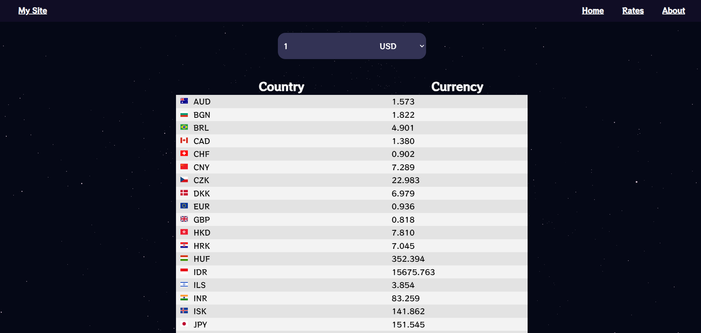

# CURRENCY APP

Currency App with React, Redux, NEXTJS and TypeScript with Awesome animation using Framer motion and Canvas.

---

## Installation:

In the project directory, you can run:

1. Clone the repository

```
git clone https://github.com/AndrewTihonyuk878/currency-app
```

2. Install all packages

```
npm install
```

3. Runs the app in the development mode.

```
npm start
```

4. Open http://localhost:3000 to view it in the browser.
5. Launches the test runner in the interactive watch mode.

```
npm test
```

---

## Preview:


